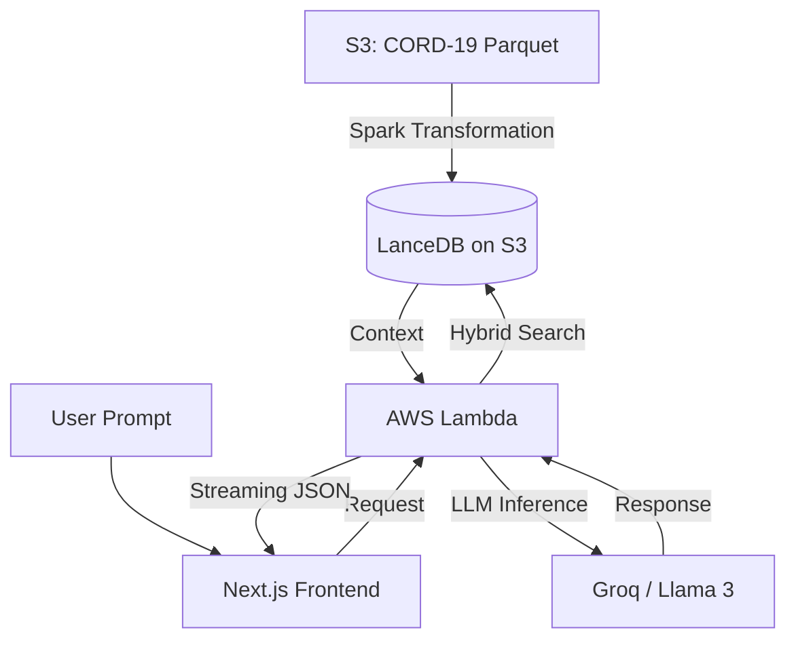

# Portfolio Project: Professional Distributed RAG Application (Serverless & Low-Cost)

This plan outlines the architecture and implementation of a state-of-the-art **Retrieval-Augmented Generation (RAG)** system designed to showcase senior-level engineering skills while maintaining a **near-zero cost** footprint.

The project leverages **3.3 million chunks** originally processed via Apache Spark, proving that high-scale AI applications don't require expensive persistent infrastructure.

## User Review Required

> [!IMPORTANT]
> **Key Decisions & Requirements**:
> 1.  **Vector Database**: **LanceDB** stored on **AWS S3**. This provides ultimate cost-efficiency (pay-only-for-storage) and high performance via the Lance format.
> 2.  **Compute**: **AWS Lambda** for the backend. No persistent server costs; handles 3M+ records with low latency thanks to LanceDB's serverless nature.
> 3.  **Inference**: **Groq API** (Llama 3 70B). Provides ultra-fast, high-quality responses at a fraction of the cost of local GPUs or OpenAI.
> 4.  **Framework**: **LlamaIndex** will orchestrate the RAG pipeline for its native support for LanceDB and serverless environments.
> 5.  **Aesthetic Focus**: The frontend will prioritize a high-end "Big Tech" aesthetic (Inter/Outfit typography, smooth Framer Motion transitions, and a dark/glassmorphism mode).

## System Architecture

---

## Phase 1: Distributed GPU Embedding & LanceDB Ingestion

Generate embeddings for the **existing 3.3M chunks** (processed by EMR) using high-performance GPU nodes with a cost-optimized strategy.

### [NEW] `infrastructure/manage_vllm_gpu.py`
A utility script to manage the lifecycle of a **vLLM Inference Server**:
- **Spot with Fallback**: Tries to request a Spot instance (`g4dn.xlarge`) first for ~70% savings, falling back to On-Demand if capacity is limited.
- **Auto-Boot**: Automatically starts vLLM in a Docker container serving the embedding model.

### [NEW] `spark_jobs/ingest_to_lancedb.py`
A high-throughput ingestion job that:
- Reads the **pre-processed Parquet chunks** from S3.
- Executes batched HTTP requests to the vLLM server for embedding generation.
- Stores results in a **LanceDB table on S3**, leveraging the same VPC for zero data transfer costs.

---

## Phase 2: Serverless Backend (AWS Lambda)

Building a production-ready serving layer with zero idle cost.

### `api/lambda_function.py`
- **LlamaIndex Integration**: Implements the `LanceDBVectorStore`.
- **Groq Implementation**: Uses `Groq` LLM subclass for sub-second inference.
- **Optimization**: Minimal dependency bundle to ensure fast Lambda cold starts.
- **RAG Logic**: Advanced retrieval (top-k + metadata filtering) across the 3.3M records.

---

## Phase 3: Premium Frontend (Next.js)

Creating the "First Impression" that sells the project.

### `frontend/app/page.tsx`
- **Framework**: Next.js with App Router.
- **UI Components**: Shadcn/UI for professional-grade design.
- **Features**: 
    - Real-time streaming chat.
    - **Cost-Transparency Dashboard**: Showcasing how the system queries 3M+ records for fractions of a cent.
    - Source attribution with direct links to original documents.

---

## Phase 4: Quality & Evaluation (RAGAS)

Demonstrating a data-driven approach to AI quality without expensive LLM tokens.

- **Automated Evaluation**: Run **RAGAS** metrics (Faithfulness, Answer Relevancy) using Groq as the judge.
- **Performance Benchmarks**: Documenting LanceDB-on-S3 latency vs. traditional vector DBs.
- **README.md**: Comprehensive technical breakdown focusing on **Serverless Scalability** and **Cost Optimization**.

